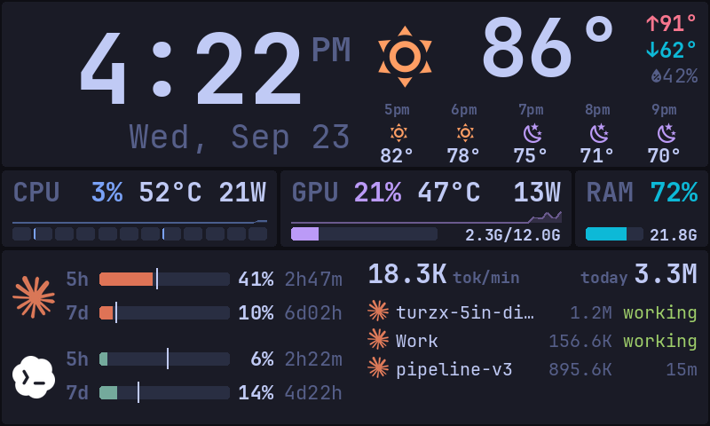

# turzx

Modular dashboard for the Turzx / Turing Smart Screen 5" (800×480, USB, "rev C" protocol).
Colors come from your Omarchy theme, and the screen follows the desktop session:
it dims during the screensaver and turns off when you lock.



Design notes, protocol quirks and the reasoning behind the visual rules are in
[docs/DESIGN.md](docs/DESIGN.md).

## Setup

```sh
python3 -m venv .venv && .venv/bin/pip install -e .
sudo cp 70-turzx.rules /etc/udev/rules.d/ && sudo udevadm control --reload && sudo udevadm trigger --subsystem-match=tty
```

## Run

```sh
.venv/bin/turzx                          # drive the screen with layouts/default.toml
.venv/bin/turzx --layout compact         # use layouts/compact.toml
.venv/bin/turzx --layout compact2        # compact with a short side-by-side top band
.venv/bin/turzx --layout dense-vertical   # smaller clock, five stacked forecast hours
.venv/bin/turzx --list                   # list layout presets and widget types
.venv/bin/turzx --preview                # render to preview.png instead of the hardware (live)
.venv/bin/turzx --preview --once         # render one frame and exit
.venv/bin/turzx --preview --once --sample-data  # fixed clock and sample values; no live data fetches
.venv/bin/turzx -c path/to/file.toml     # use any layout file
```

## Run at login

```sh
mkdir -p "$HOME/.local/bin"
ln -sfn "$PWD/.venv/bin/turzx" "$HOME/.local/bin/turzx"
systemctl --user link "$PWD/contrib/turzx.service"
systemctl --user enable --now turzx
journalctl --user -u turzx -f            # logs
systemctl --user restart turzx           # after editing code or layouts
```

To make the service use another layout persistently:

```sh
systemctl --user edit turzx              # add:  [Service]
                                         #       Environment=TURZX_LAYOUT=compact2
systemctl --user restart turzx
```

## Layouts

A layout is a TOML file in `layouts/`. It has a `[display]` table and a list of
`[[widget]]` entries. Each widget entry has a `type`, a `box = [x, y, width, height]`
on the 800×480 canvas, and any widget options.

To try a variant, copy `layouts/default.toml`, edit the copy, and check it with
`--preview --once --sample-data` before running it on the screen. Sample data is
available for the built-in widgets, so repeated renders use the same clock and
readings. The configured theme still determines the colors.

The example layouts leave location unset. Set `TURZX_LATITUDE` and
`TURZX_LONGITUDE` in your environment (or a private systemd user drop-in) to
show local weather and control `night_brightness`. Keep coordinates out of
committed layouts. A widget's own coordinates override the environment when
you need a different location for that widget.

Several widgets can share one card. Add a `[[card]]` entry with its own `box`,
then give each widget inside it `frame = false`. The default layout uses this
for the bottom row: AI limits on the left and agents on the right, in one card.
Layout loading checks that boxes fit the 800×480 screen, widgets do not overlap,
frameless widgets sit inside a shared card, and update intervals are positive.

### `[display]` options

| key | default | meaning |
|---|---|---|
| `port` | `"auto"` | serial device path, or `"auto"` to find the awake screen |
| `brightness` | `50` | 0–100 while the desktop is active |
| `night_brightness` | unset | 0–100 at night. Brightness fades from `brightness` to this as the sun goes from 6° above to 6° below the horizon (and back at dawn). Sun position is computed locally, no network |
| `latitude`, `longitude` | environment or weather widget | location for `night_brightness` |
| `dim_brightness` | `10` | 0–100 while the Omarchy screensaver runs |
| `follow_session` | `true` | dim during the screensaver; turn off when locked or when all monitors are off |
| `flip` | `false` | rotate 180° if the screen is mounted upside down |
| `theme` | `"current"` | an Omarchy theme name, or `"current"` to follow the active theme live |
| `muted_lift` | `0` | 0–1: brighten secondary text from the theme's dark foreground toward the main text color |
| `font` | JetBrains Mono | a monospaced Nerd Font family installed for fontconfig, e.g. `"UbuntuMono Nerd Font"` (the icons come from it) |
| `font_scale` | `"match"` | `"match"` scales `font` so its characters are as wide as JetBrains Mono's (0.6 em), which layout sizes are tuned to; or a number |

### Widgets

Every widget also accepts `interval`: the number of seconds between data refreshes. `cpu`, `gpu` and `memory` accept `smooth`: a rolling-mean window in seconds for the displayed numbers (default 2, 0 disables). `cpu` and `gpu` also accept `graph_smooth` for their history graphs (default 2, 0 = raw spikes). `color` options take a palette role name: `accent`, `cyan`, `magenta`, `green`, `yellow`, `orange` or `red`.

| type | options | shows |
|---|---|---|
| `clock_weather` | all `clock` + `weather` options, `icon_behind`, `ampm_behind`, `hourly_icon_behind`, `stale` (`text` / `icon`), `hours` (5), `humidity_min` (0), `temp_size` (90), `hilo_size` (24), `hilo_style = "below"` (high, low and humidity on one line under the temperature, told apart by color alone; with `icon_left`, the icon grows to fill the card's height; the temperature keeps its size), `date_size` (38), `time_size` (132), `condense_one` (true), `ampm_style` (`watermark` behind the digits / `raised` / `side` / `below`: small, under the time, right-aligned), `ampm_size`, `sun` (false; true puts the next sunrise and sunset on the left of the `below` AM/PM line; needs a location), `align = "time"` (weather card: temperature at the time card's digit size, on the same bottom line), `arrangement` (`split` / `row`: everything side by side in one short band), `split` (0.5, time/weather boundary for `row`), `show` (`both` / `time` / `weather`: one part per card), `gap` (14), `forecast` / `hilo` (true; false leaves them to a `forecast` widget), `style` (`dense` / `band`: horizontal time, weather and hourly columns) | full-width card: time and date on the left; current weather and a 5-hour forecast on the right |
| `clock` | `format` (strftime, default `%-I:%M`), `ampm` | time, AM/PM, date |
| `weather` | `latitude`, `longitude`, `units` (`imperial`/`metric`) | current conditions + 5-hour forecast (Open-Meteo) |
| `cpu` | `label`, `color`, `size` (30), `temp_unit` (`°C`), `watt_digits` (2), `ram` (`bar`: RAM bar at the bottom of the card; `column`: icon over a vertical RAM bar at the right edge; `inline`: RAM bar in the headline between the icon and the readings, graph under the headline), `cores` (true; false hides the per-core bars), `power` (true; false hides wattage), `core_step` (5% in the regular layout), `temp_warn`, `temp_crit`, `power_warn`, `power_crit`, `style = "dense"` | one-line load / temperature / package power over a history graph, per-core bars |
| `gpu` | `index`, `label`, `color`, `size` (30), `temp_unit` (`°C`), `power` (true; false hides wattage), `mem_numbers` (true; false hides RAM/VRAM used/total), `vram` (`inline`: VRAM bar in the headline between the icon and the readings instead of the bottom bar, graph under the headline), `temp_warn`, `temp_crit`, `power_warn`, `power_crit`, `style = "dense"` | one-line NVIDIA load / temperature / power over a history graph, VRAM bar |
| `ai_usage` | `providers` (`claude`, `codex`, `agy`: Antigravity's Gemini quota from `agy -p /usage`, read every 5 minutes; Flash and Pro share it, the Claude/GPT group is left out), `resets` (`always` / `soon`), `window_labels` (true; false = thick 5h / thin 7d rows), `arrangement = "stacked"` (per provider: 5h and 7d % spanning the bars' width over full-width 5h and 7d bars; an unstarted 5h window shows its full `5h00m` countdown), `session_pct` (0; e.g. 10: notch the 7d bar every 10 % as an estimate of one full 5h session's weekly share), `pace_7d` (`linear` / `workweek`: the 7d pace tick follows a weekly routine: `work_hours` (`9-18`) on `workdays` (`mon-fri`) count fully, other waking weekday hours `evening_weight` (0.25), waking weekend hours `weekend_weight` (0.15), `sleep_hours` (`1-7`) not at all), `stale` (`text` / `icon`), `style = "dense"` (one provider per 80 px card) | 5-hour / 7-day limits with pace markers |
| `memory` | `color`, `label`, `size` (30), `style` (`dense`, `strip`: one line, `card`: headline + bar with no graph, `vertical`: icon over a bottom-up bar for a narrow card), `mem_numbers` (true; false hides used/total) | one-line RAM %, used/total, full-width bar |
| `agents` | `active_minutes` (30; up to 1440; sessions whose process has exited (Claude Code's `~/.claude/sessions` registry, Codex's open rollout logs) drop out a minute after their last write, as does a Claude session replaced by `/clear`; Codex subagent threads are never listed), `working_seconds` (60), `rate_minutes` (5; up to 1440), `stats` (`top` / `left` / `none`), `rows` (`double` / `single`), `max_rows` (cap before "+N more"), `waiting` (false; true shows a bell and a magenta timer when a session is stopped on a tool call: a question or plan approval at once, a permission prompt after `working_seconds` of silence; a long-running command looks the same), `summary` (false; true adds sessions per tool and the working count to the "+N more" row), `row_height` (28), `spread` (false; true spreads single rows over the card height), `context_bar` (false; true puts context tokens and a slim fill bar between name and timer on single rows), `time_colors` (working dot colored by how long the job has run, idle timer by how long it has sat idle: green → yellow at `time_warn` 10 min → red at `time_crit` 20 min), `context_colors` (name → yellow → red as context grows: `context_warn_pct`/`context_crit_pct` 60/85 % of the window when logged (Codex), else `context_warn`/`context_crit` 200K/400K tokens (Claude)), `status` (`text` / `dot`), `pulse` (10 s breathing cycle), `pulse_step` (1 s redraw while a dot or bell shows; otherwise the card redraws only when an idle timer ticks over, at least once a minute), `cache_ring` (per-session cache-hit ring), `tokens` (true; false hides the per-session token column), `detail_rows` (0; with that many sessions or fewer, each gets a second line: model, context-fill bar and context tokens), `claude_window` (`auto`: Claude Code's `autoCompactWindow` from `~/.claude/settings.json`, else 1M; Claude's context window, which its logs don't state; when known, Claude names color by % of it like Codex), `name_weight` (`regular`), `style = "dense"`, `show_history` | token burn (tok/min, today) and active Claude Code / Codex sessions |
| `forecast` | weather options, `hours` (12), `columns` (2), `fill` (fonts and icons sized to the rows, shrunk to fit the width), `summary` (hi/lo/humidity header), `stale` | hourly forecast list wrapped into columns; shares the weather fetch |
| `burn` | `rate_minutes` (5; up to 1440), `cache_ring` | one line: rolling tokens/min, rolling cache-hit ring, today's running total |
| `network` | `interface` (default: all physical), `smooth` (samples, 2) | download/upload rate, never below the K unit (not in the default layout) |

Presets: `default` uses words and 30 px stat lines. `compact` uses icons,
weather symbols behind temperatures, seven hourly columns, and a breathing
working dot. `compact2` keeps that style but puts the date in a column and everything
in the top band side by side (140 px), giving the CPU/GPU/RAM row more height.
`compact3` gives each job its own box: time, current weather (with hi/lo/humidity),
a one-column forecast down the right edge, CPU with its RAM bar, GPU, and a bottom
card sized for exactly 5 agent sessions plus "+N more".
`dense-vertical` uses a 120 px header with five vertically stacked forecast
hours, a 72 px hardware row, side-by-side AI cards, and full-width single-line
session rows. When three or fewer sessions are active, it uses the spare space
for larger CPU/GPU history graphs. [See the sample preview](docs/dense-vertical.png).

## Writing a widget

Add `turzx/widgets/<name>.py`. It's registered automatically:

```python
from turzx import theme as t
from turzx.widget import Widget, register

@register("hello")
class Hello(Widget):
    interval = 5.0              # seconds between update() calls

    def update(self):           # runs on a worker thread; fetch data here
        self.msg = self.options.get("text", "hi")

    frame_interval = None       # set (seconds) to redraw for animation between updates

    def draw(self, d, w, h):    # d is a PIL ImageDraw sized w×h
        y = t.card(d, w, h, "HELLO")
        d.text((t.PAD, y), self.msg, font=t.font(t.BODY), fill=t.TEXT)
```

Then add a `[[widget]]` entry with `type = "hello"` and a `box` to a layout.

Only pixels that changed since the last draw are sent to the screen.

Use the helpers in `turzx/theme.py` (`big_pct`, `pct_text`, `temp_text`,
`watts_text`, `stat_line`, `bar`, `sparkline`, `text_right`, `fields_right`, `icon`) so a new
widget follows the same visual rules as the others. The rules are described in
DESIGN.md.

## Tools

- `scripts/preview.py` renders what the screen should show to `preview.png`,
  without the hardware. By default it uses fixed sample data (about 0.1 s,
  identical every run, good for before/after comparisons). `--live 6` uses real
  data collected for 6 seconds so graphs fill in. `-l <layout>` picks a preset,
  and `--crop X,Y,W,H -z 3` zooms into one region to check pixel detail.
  `--show` keeps an `imv` window open on the PNG; imv reloads on every render, so
  one window always shows the latest preview.

- `scripts/colortest.py` sends identical color swatches through the full-frame and
  partial-update encodings, to check the pixel format. Stop the service before running it.

## Code map

- `turzx/driver.py`: rev C serial protocol (`TurzxDisplay`) and `PreviewDisplay`
- `turzx/app.py`: CLI, layout loading, scheduler, dirty-region diffing, session and theme following
- `turzx/session.py`: lock, screensaver and monitor-power detection (Omarchy + Hyprland)
- `turzx/widget.py`: widget base class and registry
- `turzx/theme.py`: palette (from Omarchy), fonts, drawing helpers, number formatting
- `turzx/widgets/`: one module per widget
- `turzx/assets/`: Claude and Codex logos (rendered from Omarchy's SVGs)
- `layouts/`: layout presets
- `contrib/turzx.service`: systemd user unit
- `70-turzx.rules`: udev rule that gives the logged-in user access to the screen
